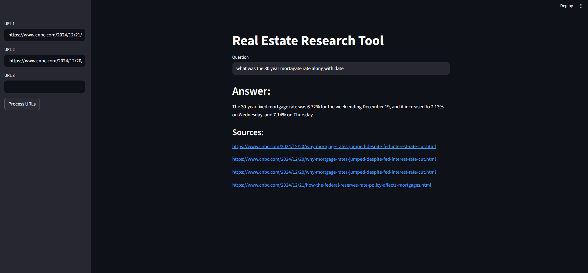
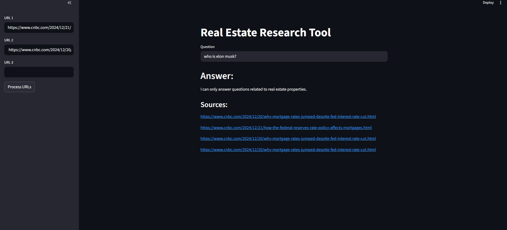

# 🏠 Real Estate Research Tool

A Retrieval-Augmented Generation (RAG) application that answers questions about real estate and mortgage data from any webpage — and refuses to answer anything off-topic.

Paste up to 3 URLs, ask a question, and get a grounded answer with sources. Ask something unrelated to real estate and the AI politely declines.

---

## Demo

**On-topic — mortgage rate question:**



> "The 30-year fixed mortgage rate was 6.72% for the week ending December 19, and it increased to 7.13% on Wednesday, and 7.14% on Thursday."

**Off-topic — blocked by custom prompt:**



> "I can only answer questions related to real estate properties."

---

## How It Works

1. Paste up to 3 real estate or mortgage-related URLs into the sidebar
2. Click **Process URLs** — the app scrapes, chunks, and stores the content in a vector database
3. Ask any question — the app retrieves the most relevant chunks and sends them to an LLM
4. The LLM answers **only** if the question is real estate related, with sources cited

```
URLs → WebBaseLoader → Text Splitter → Chroma Vector DB
                                              ↓
Question → Retriever → Relevant Chunks → Custom Prompt → LLaMA 3.3 (Groq) → Answer + Sources
```

---

## What I Built On Top of the Base Project

- **Custom prompt template** (`prompt.py`) that constrains the LLM to only answer real estate questions — off-topic questions are refused regardless of context
- Separated prompt logic into its own module for clean architecture
- Integrated **Groq's LLaMA 3.3 70B** as the LLM for fast, free inference
- Used **HuggingFace sentence-transformers** for local embeddings (no OpenAI embedding cost)
- Persistent **Chroma vector store** with collection reset on each new URL batch

---

## Tech Stack

| Layer | Tool |
|---|---|
| LLM | LLaMA 3.3 70B via Groq API |
| Embeddings | sentence-transformers/all-MiniLM-L6-v2 (HuggingFace) |
| Vector Store | Chroma (persistent) |
| RAG Framework | LangChain |
| Web Scraping | LangChain WebBaseLoader |
| Frontend | Streamlit |
| Environment | python-dotenv |

---

## Project Structure

```
real-estate-tool/
├── app.py                  # Streamlit UI
├── rag.py                  # Core RAG pipeline — scraping, chunking, retrieval, generation
├── prompt.py               # Custom real estate prompt template
├── requirements.txt
├── .env                    # API keys (not committed)
├── .gitignore
└── resources/
    └── vectorstore/        # Chroma persistent storage
```

---

## Run Locally

```bash
git clone https://github.com/your-username/real-estate-tool.git
cd real-estate-tool
python -m venv venv
venv\Scripts\activate        # Windows
# source venv/bin/activate   # Mac/Linux
pip install -r requirements.txt
```

Create a `.env` file in the root folder:

```
GROQ_API_KEY=your-groq-api-key-here
```

Get a free Groq API key at [console.groq.com](https://console.groq.com)

```bash
streamlit run app.py
```

---

## Example Questions to Try

Paste these two CNBC URLs:
- `https://www.cnbc.com/2024/12/21/how-the-federal-reserves-rate-policy-affects-mortgages.html`
- `https://www.cnbc.com/2024/12/20/why-mortgage-rates-jumped-despite-fed-interest-rate-cut.html`

Then ask:
- *"What was the 30 year fixed mortgage rate along with the date?"*
- *"How does the Fed rate affect mortgage rates?"*
- *"Who is Elon Musk?"* ← watch it get blocked

---

## Attribution

Base project structure and course content by [Dhaval Patel](https://github.com/codebasics) — Codebasics GenAI Course.
Custom prompt engineering, LLM integration with Groq/LLaMA, and architectural modifications by Tejaswini Seeram.

---

## What I Learned

- How RAG pipelines work end-to-end — from raw URLs to grounded LLM answers
- How to constrain LLM behavior using system-level prompt engineering
- Why separating prompt logic from pipeline logic matters for maintainability
- How chunking strategy (chunk size, separators) affects retrieval quality